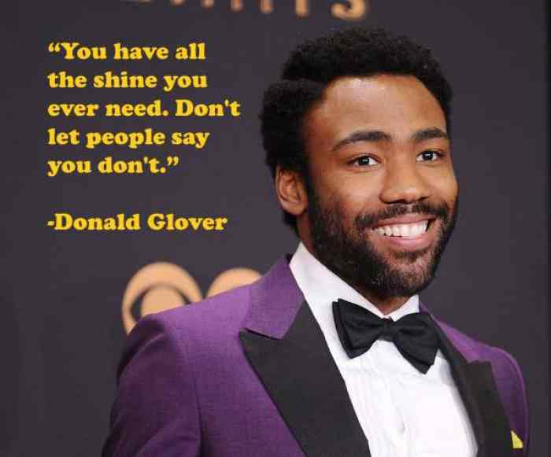

# OTB .NET team interview process

Welcome to the OTB .NET team's interview process. This readme will take you through what to expect during your half day with the OTB .NET team.

| Activity | Time |
|----------|------|
| [Introduction and CV discussion](#introduction-and-cv-discussion) | 45 minutes |
| [Kata](#kata) | 1 hour |
| [Meet the team](#meet-the-team) | 15 minutes |
| [Development tour](#development-tour) | 30 minutes |
| [Bug fixing](#bug-fixing) | 45 minutes |
| [Your questions answered, AOB](#any-other-business) | 45 minutes |

As you can see we have allowed *four (4) hours* for the interview process.

## Introduction and CV discussion

During this phase of the interview we will be discussing your knowledge of [On The Beach](https://www.onthebeach.co.uk), and your work history based on your CV.

## Kata

Currently we use two Katas. We use the [FizzBuzz Kata](/FizzBuzz/readme.md) with people who we feel to be still developing their skills as software engineers. For more advanced software engineers we use the [Checkout kata](checkout.md).

In all cases you will be completing the Kata with (a) member(s) of the team, and the aim of the kata is to help us understand a number of things:

* What actually is your level of skill? (it turns out CVs give us a rough pointer, but not a full picture)
* What is your experience level with TDD?
* How do you work with other people?
* How do you approach solving a problem?

This is your opportunity to really shine and show us what you can do.

The idea of doing the kata _is not_ to reach a complete solution.

We will be supplying a laptop to work on, with Visual Studio and Resharper. We use git (specifically GitHub Enterprise) internally, so we would like you to use git. If you don't currently use a source control tool don't worry. You will also be able to access the internet should you need to look anything up.

## Meet the team

We aim to provide a short opportunity for you to meet the people you will be working with should you join the OTB .NET team. If you've questions to ask this is a good opportunity.

## Development tour

We will take you for a tour of our development facilities, briefly introducing you to other teams within development. However please bear in mind that [development will shortly be relocating](https://www.manchestereveningnews.co.uk/business/business-news/former-aircraft-factory-thats-been-14890328). We'll introduce to as many members of development senior management as possible and this is another good opportunity to ask questions.

## Bug fixing

This is the second, and last, slot in front of a computer today. This is a chance for you to have a look at how we write code, and to show us how you would approach tackling a bug in our software (sorry, we're not perfect, on the other hand we do acknowledge that).

Again you will be:
* working on one of our laptops, with Visual Studio, Resharper and Git
* able to access the internet should you need to look anything up
* working with (a) member(s) of the team

## Any other business

By this point hopefully we'll all know each as well as can be expected after about 3 and half hours together, but if we have any questions left we'll ask them here. At the same time if you have any questions you haven't had chance to raise, this is your opportunity as well.
